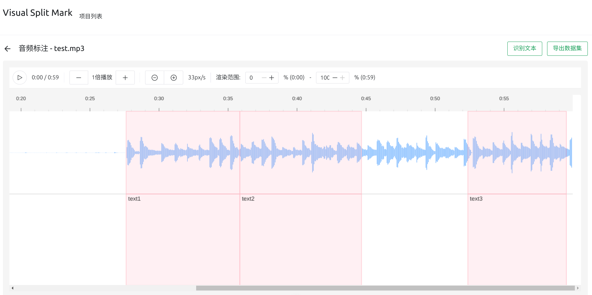

# Visual Split Mark

[English](README_EN.md) | 简体中文

一个专门用于制作 Whisper 模型微调数据集的音频标注工具。通过直观的可视化界面，帮助用户快速准确地创建高质量的语音识别训练数据。

> **注意**: 这是一个个人项目，功能和稳定性可能有限。如果您没有处理长音频（1小时以上）的特殊需求，建议使用更成熟的开源方案 [Label Studio](https://github.com/HumanSignal/label-studio)。本项目的主要特点是支持在很长的原始音频上直接进行标注和动态分割，避免了预先分割音频的繁琐工作。而 Label Studio 更适合对已分割好的短音频进行标注。

## 项目说明



本项目主要用于生成 [Whisper-Finetune](https://github.com/yeyupiaoling/Whisper-Finetune) 项目所需的微调数据集。为了提高标注效率，项目集成了 Whisper 转录功能，可以先通过 Whisper 进行初步转录，再进行人工校正。如果你需要一个简单的 Whisper API 服务，可以参考 [whisper-api](https://github.com/Zhenyi-Wang/whisper-api) 项目。

## 主要功能r

### 音频可视化与标注
- 波形可视化显示
- 区域选择和时间调整
- 文本标注和编辑
- 支持 Whisper API 文本识别
- 自动保存标注数据

### 播放控制
- 空格键快捷播放/暂停
- 可调节播放速度（0.5x - 5x）
- 点击标注区域快速定位
- 波形缩放控制（像素/秒可调）

### 数据导出
- 符合 Whisper-Finetune 格式要求
- JSONL 格式数据文件
- 自动分割音频片段
- 导出进度实时显示

## 快速开始

### 安装
```bash
yarn install
```

### 运行
```bash
# 开发模式
yarn dev

# 构建部署
yarn build
```

### 配置 Whisper API
在项目设置中配置 Whisper API URL 以启用文本识别功能。推荐使用 [whisper-api](https://github.com/Zhenyi-Wang/whisper-api) 作为后端服务。

## 使用说明

### 标注流程
1. 创建项目并上传音频文件
2. 可选：使用 Whisper API 进行初步转录
3. 通过波形界面选择音频片段
4. 添加或编辑文本标注
5. 导出数据集

### 标注操作
- **区域选择**：在波形区域拖动鼠标
- **时间调整**：拖动区域边界
- **文本编辑**：点击标注区域右上角的编辑按钮
- **删除标注**：点击标注区域右上角的删除按钮

### 快捷键
- 空格键：播放/暂停
- 更多快捷键正在开发中...

## 数据格式

### 存储结构
- 项目数据：`storage/data/`
- 导出数据：`storage/exports/YYYYMMDD_HHmmss_项目名_音频文件名/`

### 导出选项

导出数据集时支持以下选项：

1. 合并模式
   - 自动合并相邻的标注片段
   - 合并条件：总时长在15-30秒之间
   - 适用于长文本的语音识别训练

2. 合并方式
   - 严格模式：只合并时间间隔小于指定时长的标注
   - 宽松模式：合并任意标注（不限间隔）
     - 可选择是否保留标注之间的空白间隔
     - 移除间隔时会自动调整时间戳

3. 时间戳模式
   - 在合并模式下记录原始标注的时间戳
   - 可用于分析和校验合并后的数据
   - 仅在合并模式开启时可用

### 导出格式

#### 目录结构
```
storage/exports/YYYYMMDD_HHmmss_项目名_音频文件名/
├── dataset/                # 音频片段目录
│   ├── uuid1.wav          # 音频片段文件
│   ├── uuid2.wav
│   └── ...
├── dataset.json           # 数据集描述文件（JSONL 格式）
└── config.json           # 导出配置文件
```

#### config.json 格式
```json
{
  "version": "1.0.0",           // 导出格式版本
  "exportTime": "2024-02-06T14:38:30.000Z",  // 导出时间
  "projectName": "项目名称",
  "audioFile": {
    "name": "原始音频文件名",
    "duration": 3600.5          // 音频总时长（秒）
  },
  "config": {                   // 导出配置
    "mergeSentences": true,     // 是否合并标注
    "includeTimestamps": true,  // 是否包含时间戳
    "mergeOnlyConsecutive": true, // 是否只合并连续标注
    "minDuration": 15,          // 最小合并时长（秒）
    "maxDuration": 30,          // 最大合并时长（秒）
    "maxGap": 1,                // 最大间隔时长（秒）
    "keepGaps": false           // 是否保留间隔
  },
  "stats": {                    // 导出统计
    "totalAnnotations": 100,    // 原始标注数量
    "exportedSegments": 80,     // 导出片段数量
    "totalDuration": 1200.5     // 总时长（秒）
  }
}
```