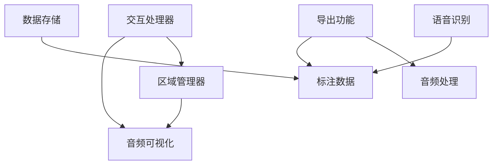

# 标注系统模块

## 模块概述

标注系统模块是 Visual Split Mark 的核心功能模块，负责音频标注的创建、管理、交互和导出。该模块采用分层设计，将数据管理、交互处理、语音识别和导出功能解耦，实现了灵活的标注功能。

## 文件结构

```
composables/
├── useRegionManager.ts     # 区域管理器
├── useInteractionHandler.ts # 交互处理器
└── useWhisper.ts          # 语音识别集成

utils/
└── export.ts              # 标注导出功能

server/api/data/
├── save.post.ts           # 数据保存接口
└── load.ts               # 数据加载接口

types/
└── project.ts            # 标注相关类型定义
```

## 类型定义

### 标注数据结构 (`types/project.ts`)

```typescript
// 项目配置
interface Project {
  id: string
  name: string
  description?: string
  whisperApiUrl?: string  // 语音识别 API 配置
  createdAt: Date
  updatedAt: Date
}

// 标注数据
interface Annotation {
  id: string
  audioFileId: string     // 关联的音频文件
  start: number          // 开始时间（秒）
  end: number           // 结束时间（秒）
  text: string          // 标注文本
  whisperText?: string  // 识别文本
  createdAt: Date
  updatedAt: Date
}
```

## 核心功能

### 1. 区域管理 (`useRegionManager.ts`)

区域管理器负责标注区域的数据管理，提供完整的 CRUD 操作和高级功能。

```typescript
const regionManager = useRegionManager()

// 基本操作
regionManager.addRegion({
  id: 'unique-id',
  start: 1.5,
  end: 3.2,
  text: '标注文本'
})

regionManager.updateRegion({
  id: 'unique-id',
  start: 1.6,
  end: 3.5,
  text: '更新的文本'
})

regionManager.removeRegion('unique-id')

// 查询操作
const region = regionManager.getRegion('unique-id')
const allRegions = regionManager.getAllRegions()
const count = regionManager.getRegionCount()

// 高级功能
const regionAtTime = regionManager.findRegionByTime(2.5)
const overlapping = regionManager.findOverlappingRegions(1.0, 4.0)
const merged = regionManager.mergeOverlappingRegions(['id1', 'id2'])
const split = regionManager.splitRegion('unique-id', 2.0)
```

### 2. 交互处理 (`useInteractionHandler.ts`)

交互处理器负责用户界面的交互逻辑，包括鼠标事件、选区和按钮交互。

```typescript
const interactionHandler = useInteractionHandler()

// 鼠标事件处理
const clickStartTime = interactionHandler.handleMouseDown(
  event,           // MouseEvent
  canvas,          // HTMLCanvasElement
  container,       // HTMLElement
  duration,        // number
  regions,         // Map<string, Region>
  addButtonBounds, // ButtonBounds
  editButtonBounds,// ButtonBounds
  deleteButtonBounds, // ButtonBounds
  seekCallback     // (time: number) => void
)

// 状态管理
interactionHandler.clearSelection()  // 清除选区
interactionHandler.clearAll()       // 清除所有状态

// 回调设置
interactionHandler.onRegionClick.value = (id: string) => {
  // 处理区域点击
}

interactionHandler.onAnnotationChange.value = (annotation) => {
  // 处理标注更新
}

// 按钮回调
interactionHandler.onAddButtonClick.value = () => {
  // 处理添加按钮点击
}

interactionHandler.onEditButtonClick.value = (id) => {
  // 处理编辑按钮点击
}

interactionHandler.onDeleteButtonClick.value = (id) => {
  // 处理删除按钮点击
}
```

### 3. 语音识别 (`useWhisper.ts`)

语音识别集成模块提供与 Whisper API 的集成，支持自动生成标注。

```typescript
const whisper = useWhisper()

// 转写音频文件
const annotations = await whisper.transcribe(audioFile)

// 配置示例
const project = {
  id: 'project-id',
  name: 'Project Name',
  whisperApiUrl: 'https://api.whisper.example.com/v1/transcribe'
}
```

### 4. 标注导出 (`utils/export.ts`)

导出功能支持将标注数据和音频片段打包导出。

```typescript
// 导出数据
const exportData = await exportAudioSegments(audioFile, annotations)

// 生成 JSON
const jsonData = generateExportJson(exportData)

// 创建 ZIP 包
const zipBlob = await createExportZip(exportData)

// 下载文件
downloadBlob(zipBlob, 'annotations.zip')
```

导出的 ZIP 包结构：
```
annotations.zip/
├── data.json          # 标注数据
└── audio/            # 音频片段
    ├── 1.wav
    ├── 2.wav
    └── ...
```

### 5. 数据存储 (`server/api/data/`)

数据存储接口提供标注数据的持久化功能。

```typescript
// 保存数据
await $fetch('/api/data/save', {
  method: 'POST',
  body: {
    projects: [...],
    audioFiles: [...],
    annotations: [...],
    settings: {...}
  }
})

// 加载数据
const data = await $fetch('/api/data/load')
```

## 模块依赖关系



## 使用流程

1. **标注创建流程**
   ```mermaid
   graph LR
       A[选择区域] --> B[点击添加]
       B --> C[输入文本]
       C --> D[保存标注]
       D --> E[更新显示]
   ```

2. **语音识别流程**
   ```mermaid
   graph LR
       A[选择音频] --> B[调用API]
       B --> C[处理结果]
       C --> D[生成标注]
       D --> E[保存数据]
   ```

3. **导出流程**
   ```mermaid
   graph LR
       A[选择标注] --> B[提取音频]
       B --> C[生成JSON]
       C --> D[打包ZIP]
       D --> E[下载文件]
   ```

## 注意事项

1. **性能优化**
   - 使用 Map 存储区域数据，提高查询效率
   - 避免频繁的区域重叠检测
   - 大量标注时考虑分页加载

2. **数据一致性**
   ```typescript
   // 标注更新时同步更新所有相关状态
   const updateAnnotation = async (annotation) => {
     // 更新区域管理器
     regionManager.updateRegion(annotation)
     // 更新存储
     await projectStore.updateAnnotation(annotation)
     // 更新显示
     updateDrawing()
   }
   ```

3. **错误处理**
   ```typescript
   try {
     const annotations = await whisper.transcribe(audioFile)
   } catch (error) {
     console.error('Transcription failed:', error)
     message.error('语音识别失败')
   }
   ```

## 开发建议

1. **功能扩展**
   - 在 `composables/` 目录下创建新的组合式函数
   - 在 `types/project.ts` 中添加新的类型定义
   - 保持与现有功能的一致性

2. **代码组织**
   - 相关功能放在同一个文件中
   - 使用 TypeScript 类型定义
   - 添加必要的注释和文档

3. **测试建议**
   - 为每个核心功能编写单元测试
   - 测试边界条件和错误情况
   - 进行交互功能的集成测试 

## 交互场景示例

### 1. 创建标注

```typescript
// 1. 通过拖拽选择区域
const handleMouseDown = (e: MouseEvent) => {
  const time = getTimeFromX(e.clientX)
  selectionStart.value = time
  isDragging.value = true
}

const handleMouseMove = (e: MouseEvent) => {
  if (!isDragging.value) return
  const time = getTimeFromX(e.clientX)
  selectionEnd.value = time
}

const handleMouseUp = () => {
  if (!isDragging.value) return
  isDragging.value = false
  
  // 创建新标注
  if (selectionStart.value !== null && selectionEnd.value !== null) {
    const start = Math.min(selectionStart.value, selectionEnd.value)
    const end = Math.max(selectionStart.value, selectionEnd.value)
    
    // 打开标注对话框
    showAnnotationDialog({
      start,
      end,
      onConfirm: (text) => {
        regionManager.addRegion({
          id: nanoid(),
          start,
          end,
          text
        })
      }
    })
  }
}

// 2. 通过语音识别创建
const handleTranscribe = async () => {
  if (!selectionRange.value) return
  
  try {
    const { start, end } = selectionRange.value
    const text = await whisper.transcribe(audioFile, start, end)
    
    regionManager.addRegion({
      id: nanoid(),
      start,
      end,
      text,
      whisperText: text
    })
    
    message.success('语音识别成功')
  } catch (error) {
    message.error('语音识别失败：' + error.message)
  }
}
```

### 2. 编辑标注

```typescript
// 1. 调整区域边界
const handleHandleDrag = (regionId: string, isStart: boolean) => {
  const region = regionManager.getRegion(regionId)
  if (!region) return
  
  const handleMouseMove = (e: MouseEvent) => {
    const time = getTimeFromX(e.clientX)
    if (isStart) {
      region.start = Math.min(time, region.end)
    } else {
      region.end = Math.max(time, region.start)
    }
    regionManager.updateRegion(region)
  }
  
  const handleMouseUp = () => {
    document.removeEventListener('mousemove', handleMouseMove)
    document.removeEventListener('mouseup', handleMouseUp)
  }
  
  document.addEventListener('mousemove', handleMouseMove)
  document.addEventListener('mouseup', handleMouseUp)
}

// 2. 编辑文本
const handleTextEdit = (region: Region) => {
  showAnnotationDialog({
    text: region.text,
    onConfirm: (newText) => {
      regionManager.updateRegion({
        ...region,
        text: newText
      })
    }
  })
}
```

### 3. 区域操作

```typescript
// 1. 合并区域
const handleMergeRegions = (regionIds: string[]) => {
  const regions = regionIds.map(id => regionManager.getRegion(id))
  if (regions.some(r => !r)) return
  
  const start = Math.min(...regions.map(r => r!.start))
  const end = Math.max(...regions.map(r => r!.end))
  const text = regions.map(r => r!.text).join('\n')
  
  // 删除原有区域
  regionIds.forEach(id => regionManager.removeRegion(id))
  
  // 创建新区域
  regionManager.addRegion({
    id: nanoid(),
    start,
    end,
    text
  })
}

// 2. 分割区域
const handleSplitRegion = (regionId: string, time: number) => {
  const region = regionManager.getRegion(regionId)
  if (!region) return
  
  // 删除原有区域
  regionManager.removeRegion(regionId)
  
  // 创建两个新区域
  regionManager.addRegion({
    id: nanoid(),
    start: region.start,
    end: time,
    text: region.text
  })
  
  regionManager.addRegion({
    id: nanoid(),
    start: time,
    end: region.end,
    text: ''
  })
}
```

## 语音识别错误处理

### 1. API 错误处理

```typescript
const transcribe = async (audioFile: AudioFile, start?: number, end?: number) => {
  try {
    // 检查项目配置
    if (!currentProject.value?.whisperApiUrl) {
      throw new Error('未配置 Whisper API 地址')
    }
    
    // 检查音频文件
    if (!audioFile.wavPath) {
      throw new Error('音频文件未转换')
    }
    
    // 提取音频片段
    const audioBlob = await extractAudioSegment(audioFile.wavPath, start, end)
    
    // 调用 API
    const response = await fetch(currentProject.value.whisperApiUrl, {
      method: 'POST',
      body: audioBlob
    })
    
    if (!response.ok) {
      if (response.status === 413) {
        throw new Error('音频文件过大')
      } else if (response.status === 429) {
        throw new Error('API 调用次数超限')
      } else {
        throw new Error(`API 错误：${response.status}`)
      }
    }
    
    const result = await response.json()
    return result.text
    
  } catch (error) {
    // 网络错误
    if (error instanceof TypeError) {
      throw new Error('网络请求失败')
    }
    
    // 其他错误
    throw error
  }
}
```

### 2. 音频处理错误

```typescript
const extractAudioSegment = async (wavPath: string, start?: number, end?: number) => {
  try {
    // 检查文件存在
    const exists = await checkFileExists(wavPath)
    if (!exists) {
      throw new Error('音频文件不存在')
    }
    
    // 检查时间范围
    if (start !== undefined && end !== undefined) {
      if (start >= end) {
        throw new Error('无效的时间范围')
      }
      if (start < 0) {
        throw new Error('起始时间不能小于 0')
      }
    }
    
    // 提取音频片段
    const command = ffmpeg()
      .input(wavPath)
      .audioCodec('pcm_s16le')
      .audioChannels(1)
      .audioFrequency(16000)
    
    if (start !== undefined && end !== undefined) {
      command
        .setStartTime(start)
        .setDuration(end - start)
    }
    
    const buffer = await command.toBuffer()
    return new Blob([buffer], { type: 'audio/wav' })
    
  } catch (error) {
    if (error.code === 'ENOENT') {
      throw new Error('找不到音频文件')
    } else if (error.code === 'EACCES') {
      throw new Error('没有文件访问权限')
    } else {
      throw error
    }
  }
}
```

### 3. 错误恢复

```typescript
const retryTranscribe = async (region: Region, retries = 3) => {
  let lastError: Error | null = null
  
  for (let i = 0; i < retries; i++) {
    try {
      const text = await whisper.transcribe(
        audioFile,
        region.start,
        region.end
      )
      
      // 更新标注
      regionManager.updateRegion({
        ...region,
        text,
        whisperText: text
      })
      
      return true
    } catch (error) {
      lastError = error
      
      // 等待一段时间后重试
      await new Promise(resolve => setTimeout(resolve, 1000 * (i + 1)))
    }
  }
  
  // 所有重试都失败
  message.error(`语音识别失败：${lastError?.message}`)
  return false
}
```

## 数据迁移和备份

### 1. 数据导出

```typescript
const exportData = async () => {
  try {
    // 1. 导出项目元数据
    const metadata = {
      project: currentProject.value,
      audioFiles: projectStore.projectAudioFiles,
      annotations: projectStore.audioFileAnnotations
    }
    
    // 2. 导出音频文件
    const audioFiles = await Promise.all(
      metadata.audioFiles.map(async (file) => ({
        ...file,
        originalContent: await fs.readFile(file.originalPath),
        wavContent: await fs.readFile(file.wavPath)
      }))
    )
    
    // 3. 创建 ZIP 文件
    const zip = new JSZip()
    
    // 添加元数据
    zip.file('metadata.json', JSON.stringify(metadata, null, 2))
    
    // 添加音频文件
    audioFiles.forEach(file => {
      zip.file(`audio/original/${file.id}${path.extname(file.originalPath)}`, file.originalContent)
      zip.file(`audio/wav/${file.id}.wav`, file.wavContent)
    })
    
    // 4. 下载 ZIP 文件
    const blob = await zip.generateAsync({ type: 'blob' })
    downloadBlob(blob, `${currentProject.value?.name}-backup.zip`)
    
  } catch (error) {
    message.error('导出失败：' + error.message)
    throw error
  }
}
```

### 2. 数据导入

```typescript
const importData = async (file: File) => {
  try {
    // 1. 读取 ZIP 文件
    const zip = await JSZip.loadAsync(file)
    
    // 2. 读取元数据
    const metadataJson = await zip.file('metadata.json')?.async('string')
    if (!metadataJson) {
      throw new Error('无效的备份文件')
    }
    
    const metadata = JSON.parse(metadataJson)
    
    // 3. 验证数据
    if (!metadata.project || !metadata.audioFiles || !metadata.annotations) {
      throw new Error('备份文件格式错误')
    }
    
    // 4. 创建项目
    const project = await projectStore.createProject(
      metadata.project.name,
      metadata.project.description
    )
    
    // 5. 恢复音频文件
    for (const file of metadata.audioFiles) {
      // 读取文件内容
      const originalContent = await zip
        .file(`audio/original/${file.id}${path.extname(file.originalPath)}`)
        ?.async('nodebuffer')
      
      const wavContent = await zip
        .file(`audio/wav/${file.id}.wav`)
        ?.async('nodebuffer')
      
      if (!originalContent || !wavContent) {
        throw new Error(`找不到音频文件：${file.id}`)
      }
      
      // 保存文件
      await fs.writeFile(file.originalPath, originalContent)
      await fs.writeFile(file.wavPath, wavContent)
      
      // 添加音频文件记录
      await projectStore.addAudioFile({
        ...file,
        projectId: project.id
      })
    }
    
    // 6. 恢复标注
    for (const annotation of metadata.annotations) {
      await projectStore.updateAnnotation(annotation)
    }
    
    message.success('导入成功')
    return project
    
  } catch (error) {
    message.error('导入失败：' + error.message)
    throw error
  }
}
```

### 3. 自动备份

```typescript
const setupAutoBackup = () => {
  // 配置
  const config = {
    interval: 5 * 60 * 1000,  // 5 分钟
    maxBackups: 10,
    backupDir: 'storage/backups'
  }
  
  // 创建定时器
  const timer = setInterval(async () => {
    try {
      // 1. 导出数据
      const data = await projectStore.exportData()
      
      // 2. 生成备份文件名
      const timestamp = format(new Date(), 'yyyyMMdd-HHmmss')
      const filename = `backup-${timestamp}.json`
      
      // 3. 保存备份
      await fs.writeFile(
        path.join(config.backupDir, filename),
        JSON.stringify(data, null, 2)
      )
      
      // 4. 清理旧备份
      const files = await fs.readdir(config.backupDir)
      const backups = files
        .filter(f => f.startsWith('backup-'))
        .sort()
        .reverse()
      
      // 删除多余的备份
      for (const file of backups.slice(config.maxBackups)) {
        await fs.unlink(path.join(config.backupDir, file))
      }
      
    } catch (error) {
      console.error('自动备份失败：', error)
    }
  }, config.interval)
  
  // 清理函数
  const cleanup = () => {
    clearInterval(timer)
  }
  
  return cleanup
} 