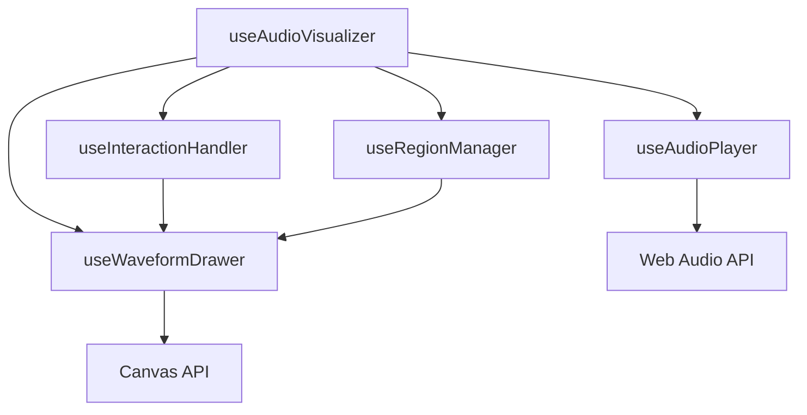

# 音频处理模块

## 模块概述

音频处理模块是 Visual Split Mark 的核心模块之一，负责音频文件的处理、播放、可视化和交互功能。该模块采用模块化设计，将不同功能拆分为独立的组合式函数（Composables），实现了高度的可复用性和可维护性。

## 文件结构

```
composables/
├── useAudioPlayer.ts     # 音频播放器核心实现
├── useAudioConverter.ts  # 音频格式转换功能
├── useAudioVisualizer.ts # 音频可视化整合模块
├── useWaveformDrawer.ts  # 波形绘制实现
├── useInteractionHandler.ts # 交互事件处理
└── useRegionManager.ts   # 区域管理功能

server/api/
├── audio/
│   └── extract.post.ts   # 音频片段提取接口
└── file/
    └── convert.post.ts   # 音频格式转换接口

types/
├── audio.ts             # 音频相关类型定义
└── project.ts          # 项目相关类型定义

utils/
└── audio.ts            # 音频处理工具函数

constants/
└── visualizer.ts       # 可视化相关常量定义
```

## 类型定义

### 核心类型 (`types/audio.ts`)

```typescript
// 音频播放器接口
interface AudioPlayer {
  audioContext: Ref<AudioContext | null>
  audioElement: Ref<HTMLAudioElement | null>
  isPlaying: Ref<boolean>
  duration: Ref<number>
  currentTime: Ref<number>
  playbackRate: Ref<number>
}

// 波形绘制器接口
interface WaveformDrawer {
  canvas: Ref<HTMLCanvasElement | null>
  canvasCtx: Ref<CanvasRenderingContext2D | null>
  channelData: Ref<Float32Array | null>
}

// 区域数据接口
interface Region {
  start: number
  end: number
  text: string
}
```

### 项目类型 (`types/project.ts`)

```typescript
interface AudioFile {
  id: string
  projectId: string
  originalName: string
  originalPath: string  // storage/uploads/ 目录下的原始文件路径
  wavPath: string      // storage/converted/ 目录下的 WAV 文件路径
  duration: number
  status: 'uploaded' | 'converting' | 'ready' | 'error'
  createdAt: Date
  updatedAt: Date
}
```

## 模块依赖关系



### 依赖说明

1. **useAudioVisualizer**
   - 文件：`composables/useAudioVisualizer.ts`
   - 主要依赖：
     - `useAudioPlayer`: 音频播放控制
     - `useWaveformDrawer`: 波形绘制
     - `useInteractionHandler`: 事件处理
     - `useRegionManager`: 区域管理
   - 关键变量：
     ```typescript
     const audioPlayer = useAudioPlayer()
     const waveformDrawer = useWaveformDrawer()
     const interactionHandler = useInteractionHandler()
     const regionManager = useRegionManager()
     ```

2. **useAudioPlayer**
   - 文件：`composables/useAudioPlayer.ts`
   - 外部依赖：Web Audio API
   - 关键变量：
     ```typescript
     const audioContext = ref<AudioContext | null>(null)
     const audioElement = ref<HTMLAudioElement | null>(null)
     const channelData = ref<Float32Array | null>(null)
     ```

3. **useWaveformDrawer**
   - 文件：`composables/useWaveformDrawer.ts`
   - 外部依赖：Canvas API
   - 配置依赖：`constants/visualizer.ts`
   - 关键常量：
     ```typescript
     const PADDING = 20
     const TIME_AXIS_HEIGHT = 40
     const WAVEFORM_HEIGHT = 200
     const COLORS = {
       waveform: '#2080f0',
       progress: '#18a058',
       selection: '#2080f0'
     }
     ```

## 核心功能

### 1. 音频播放控制 (`useAudioPlayer.ts`)

```typescript
const audioPlayer = useAudioPlayer()

// 初始化 - 加载音频文件并创建 Web Audio 上下文
await audioPlayer.initialize(audioFile)

// 播放控制 - 返回 Promise 以处理异步播放状态
await audioPlayer.playPause()

// 时间控制 - 单位为秒
audioPlayer.seek(timeInSeconds)

// 播放速率控制 - 范围：0.5x - 5x
audioPlayer.setPlaybackRate(rate)

// 资源清理 - 在组件卸载时调用
audioPlayer.destroy()
```

### 2. 波形绘制 (`useWaveformDrawer.ts`)

```typescript
const waveformDrawer = useWaveformDrawer()

// 初始化 Canvas
waveformDrawer.initialize(container) // container: HTMLElement

// 设置音频数据
waveformDrawer.setChannelData(channelData) // channelData: Float32Array

// 绘制更新
waveformDrawer.drawWaveform({
  duration,        // 音频总时长
  currentTime,     // 当前播放时间
  pixelsPerSecond, // 缩放比例
  regions,         // Map<string, Region>
  hoveredRegion,   // { id: string } | null
  selectionRange,  // { start: number, end: number } | null
  editingAnnotation, // { id: string } | null
  buttonBounds     // 按钮边界信息
})
```

### 3. 区域管理 (`useRegionManager.ts`)

```typescript
const regionManager = useRegionManager()

// 添加区域
regionManager.addRegion({
  id: 'unique-id',
  start: 1.5,  // 开始时间（秒）
  end: 3.2,    // 结束时间（秒）
  text: '标注文本'
})

// 更新区域
regionManager.updateRegion({
  id: 'unique-id',
  start: 1.6,
  end: 3.5,
  text: '更新后的文本'
})

// 删除区域
regionManager.removeRegion('unique-id')

// 获取所有区域
const regions = regionManager.getAllRegions() // 返回 Map<string, Region>
```

### 4. 交互处理 (`useInteractionHandler.ts`)

```typescript
const interactionHandler = useInteractionHandler()

// 鼠标事件处理
const clickStartTime = interactionHandler.handleMouseDown(
  event,           // MouseEvent
  canvas,          // HTMLCanvasElement
  container,       // HTMLElement
  duration,        // number
  regions,         // Map<string, Region>
  addButtonBounds, // ButtonBounds
  editButtonBounds,// ButtonBounds
  deleteButtonBounds, // ButtonBounds
  seekCallback     // (time: number) => void
)

// 设置回调函数
interactionHandler.onRegionClick.value = (id: string) => {
  // 处理区域点击
}

interactionHandler.onAnnotationChange.value = (annotation: Region & { id: string }) => {
  // 处理标注更新
}
```

### 5. 音频文件处理

#### 文件转换 (`server/api/file/convert.post.ts`)

```typescript
// 客户端调用
await $fetch('/api/file/convert', {
  method: 'POST',
  body: {
    inputPath: 'storage/uploads/original.mp3',
    outputPath: 'storage/converted/output.wav'
  }
})

// 服务端实现
const ffmpeg = spawn('ffmpeg', [
  '-i', absoluteInputPath,
  '-ar', '16000',  // 采样率
  '-ac', '1',      // 单声道
  '-c:a', 'pcm_s16le',  // 16位 PCM
  absoluteOutputPath
])
```

#### 片段提取 (`server/api/audio/extract.post.ts`)

```typescript
// 客户端调用
const segment = await audioProcessor.extractSegment(
  audioFile,
  1.5,  // 开始时间（秒）
  3.2   // 结束时间（秒）
)

// 服务端实现
const ffmpeg = spawn('ffmpeg', [
  '-i', audioPath,
  '-ss', start.toString(),
  '-t', (end - start).toString(),
  '-c', 'copy',
  outputPath
])
```

## 配置说明

### 可视化配置 (`constants/visualizer.ts`)

```typescript
// 布局配置
export const PADDING = 20
export const TIME_AXIS_HEIGHT = 40
export const WAVEFORM_HEIGHT = 200
export const ANNOTATION_HEIGHT = 40

// 交互配置
export const HANDLE_SIZE = 10
export const BUTTON_SIZE = 24
export const BUTTON_PADDING = 4
export const BUTTON_GAP = 4

// 颜色配置
export const COLORS = {
  waveform: '#2080f0',
  progress: '#18a058',
  selection: '#2080f0',
  region: '#63e2b7',
  handle: '#2080f0'
}
```

## 注意事项

1. **性能优化**
   - 波形绘制时使用 `requestAnimationFrame`
   - 大文件处理时使用 `Web Workers`
   - 及时调用 `destroy` 方法清理资源

2. **内存管理**
   ```typescript
   onUnmounted(() => {
     audioPlayer.destroy()
     window.removeEventListener('resize', handleResize)
   })
   ```

3. **错误处理**
   ```typescript
   try {
     await audioPlayer.initialize(audioFile)
   } catch (error) {
     console.error('Failed to initialize audio player:', error)
     message.error('音频加载失败')
   }
   ```

## 开发建议

1. **功能扩展**
   - 在 `composables/` 目录下创建新的组合式函数
   - 在 `types/audio.ts` 中添加相关类型定义
   - 遵循现有的模块化结构

2. **代码组织**
   - 相关功能放在同一个文件中
   - 使用 TypeScript 类型定义
   - 添加 JSDoc 注释

3. **测试建议**
   - 为每个组合式函数编写单元测试
   - 测试不同的音频格式和大小
   - 测试边界条件和错误情况 

## 错误处理

### 1. 音频加载错误

```typescript
try {
  await audioPlayer.initialize(audioFile)
} catch (error) {
  if (error instanceof AudioLoadError) {
    message.error('音频文件加载失败，请检查文件是否损坏')
  } else if (error instanceof AudioContextError) {
    message.error('音频上下文创建失败，请检查浏览器设置')
  } else {
    message.error('未知错误：' + error.message)
  }
}
```

### 2. 格式转换错误

```typescript
try {
  await convertAudio(inputPath, outputPath)
} catch (error) {
  if (error.code === 'ENOENT') {
    message.error('找不到输入文件')
  } else if (error.code === 'EACCES') {
    message.error('没有文件访问权限')
  } else if (error.message.includes('ffmpeg')) {
    message.error('FFmpeg 转换失败，请检查配置')
  } else {
    message.error('转换失败：' + error.message)
  }
}
```

### 3. 波形绘制错误

```typescript
try {
  await waveformDrawer.drawWaveform(options)
} catch (error) {
  if (error instanceof CanvasError) {
    message.error('波形绘制失败，请检查 Canvas 上下文')
  } else if (error instanceof DataError) {
    message.error('音频数据无效')
  } else {
    message.error('绘制失败：' + error.message)
  }
}
```

## 性能优化

### 1. 音频数据处理

```typescript
// 使用 Web Worker 进行音频数据处理
const worker = new Worker('audio-worker.js')
worker.postMessage({
  type: 'process',
  channelData: audioBuffer.getChannelData(0)
})

worker.onmessage = (e) => {
  const { peaks, rms } = e.data
  waveformDrawer.setPeaks(peaks)
  waveformDrawer.setRMS(rms)
}
```

### 2. 波形绘制优化

```typescript
// 使用分层 Canvas
const waveformLayer = document.createElement('canvas')
const regionsLayer = document.createElement('canvas')
const cursorLayer = document.createElement('canvas')

// 只在必要时重绘
const drawWaveform = () => {
  if (!waveformNeedsUpdate) return
  drawWaveformLayer()
  waveformNeedsUpdate = false
}

const drawRegions = () => {
  if (!regionsNeedsUpdate) return
  drawRegionsLayer()
  regionsNeedsUpdate = false
}

// 使用 requestAnimationFrame
const animate = () => {
  drawCursor()
  requestAnimationFrame(animate)
}
```

### 3. 内存管理

```typescript
// 释放不需要的资源
const cleanup = () => {
  if (audioBuffer) {
    audioBuffer = null
  }
  if (audioContext) {
    audioContext.close()
    audioContext = null
  }
  if (offscreenCanvas) {
    offscreenCanvas = null
  }
}

// 在组件卸载时清理
onUnmounted(() => {
  cleanup()
})
```

## 与其他模块集成

### 1. 与标注系统集成

```typescript
// 在音频播放器中监听标注更新
watch(() => annotations.value, (newAnnotations) => {
  // 更新波形显示
  waveformDrawer.setRegions(newAnnotations)
  // 更新时间轴标记
  timelineDrawer.setMarkers(newAnnotations)
}, { deep: true })

// 在波形绘制器中处理标注交互
const handleRegionClick = (region: Region) => {
  // 触发标注选中事件
  emit('region-select', region)
  // 定位到标注位置
  audioPlayer.seek(region.start)
}
```

### 2. 与项目管理集成

```typescript
// 监听音频文件变化
watch(() => currentAudioFile.value, async (newFile) => {
  if (!newFile) return
  
  // 初始化音频播放器
  await audioPlayer.initialize(newFile)
  
  // 加载标注数据
  const annotations = await projectStore.getAnnotations(newFile.id)
  regionManager.setRegions(annotations)
  
  // 更新波形显示
  waveformDrawer.setAudioFile(newFile)
}, { immediate: true })
```

### 3. 与导出功能集成

```typescript
// 导出音频片段
const exportSegment = async (region: Region) => {
  // 提取音频片段
  const buffer = await audioProcessor.extractSegment(
    audioBuffer,
    region.start,
    region.end
  )
  
  // 创建 WAV 文件
  const wav = await audioProcessor.createWAV(buffer)
  
  // 添加到导出数据
  exportData.segments.push({
    id: region.id,
    start: region.start,
    end: region.end,
    text: region.text,
    wavBlob: wav
  })
}
```

## 配置参考

### 1. 音频播放器配置

```typescript
const AUDIO_PLAYER_CONFIG = {
  // Web Audio API 配置
  audioContext: {
    sampleRate: 44100,
    latencyHint: 'interactive'
  },
  
  // 播放控制
  playback: {
    minRate: 0.5,
    maxRate: 2.0,
    defaultRate: 1.0
  },
  
  // 缓冲区设置
  buffer: {
    length: 4096,
    overlap: 0.1
  }
}
```

### 2. 波形绘制配置

```typescript
const WAVEFORM_CONFIG = {
  // 显示设置
  display: {
    pixelsPerSecond: 100,
    waveformHeight: 200,
    timeAxisHeight: 40,
    padding: 20
  },
  
  // 颜色主题
  colors: {
    waveform: '#2080f0',
    progress: '#18a058',
    selection: '#2080f0',
    region: {
      fill: 'rgba(32, 128, 240, 0.2)',
      stroke: '#2080f0'
    }
  },
  
  // 性能设置
  performance: {
    maxPointsPerPixel: 4,
    drawingThrottle: 16,  // ms
    useOffscreenCanvas: true
  }
}
```

### 3. 格式转换配置

```typescript
const CONVERSION_CONFIG = {
  // FFmpeg 参数
  ffmpeg: {
    sampleRate: 16000,
    channels: 1,
    audioCodec: 'pcm_s16le'
  },
  
  // 文件限制
  fileLimit: {
    maxSize: 100 * 1024 * 1024,  // 100MB
    allowedTypes: ['.mp3', '.wav', '.m4a']
  },
  
  // 存储路径
  paths: {
    uploads: 'storage/uploads',
    converted: 'storage/converted'
  }
}
```

## 调试指南

### 1. 音频播放问题

```typescript
// 检查音频上下文状态
console.log('Audio Context State:', audioContext.state)
console.log('Audio Buffer:', audioBuffer)

// 监听播放事件
audioElement.addEventListener('play', () => {
  console.log('Playing started')
})

audioElement.addEventListener('error', (e) => {
  console.error('Audio Error:', e.error)
})
```

### 2. 波形绘制问题

```typescript
// 检查 Canvas 上下文
console.log('Canvas Context:', canvasCtx)
console.log('Canvas Size:', {
  width: canvas.width,
  height: canvas.height
})

// 检查音频数据
console.log('Channel Data:', {
  length: channelData.length,
  sampleRate: audioBuffer.sampleRate
})
```

### 3. 性能监控

```typescript
// 测量绘制性能
console.time('drawWaveform')
waveformDrawer.drawWaveform(options)
console.timeEnd('drawWaveform')

// 监控内存使用
const memoryUsage = () => {
  if (performance.memory) {
    console.log('Memory:', {
      used: performance.memory.usedJSHeapSize,
      total: performance.memory.totalJSHeapSize
    })
  }
}
``` 