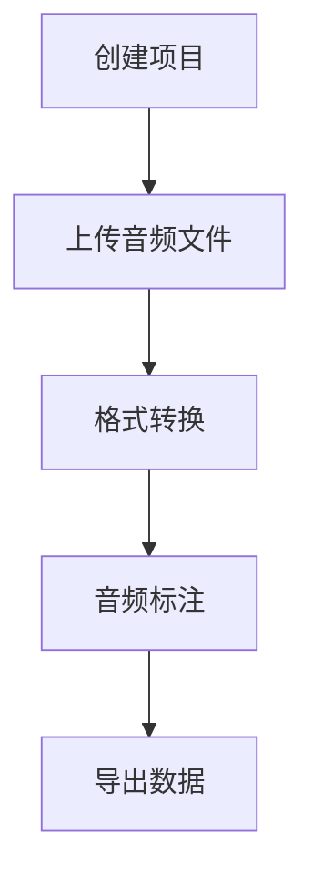

# 项目管理模块

## 概述
项目管理模块负责管理音频标注项目的生命周期，包括项目的创建、更新、删除，以及项目内音频文件的管理。该模块是整个应用的基础，为音频标注和语音识别提供了必要的数据结构和状态管理。

## 文件结构
```
├── types/project.ts           # 类型定义
├── stores/project.ts          # 状态管理
├── pages/
│   └── project/
│       ├── index.vue         # 项目列表页
│       └── [id].vue          # 项目详情页
└── utils/
    ├── storage.ts            # 数据持久化
    └── uploader.ts           # 文件上传
```

## 核心类型定义

### Project
```typescript
interface Project {
  id: string
  name: string
  description?: string
  createdAt: Date
  updatedAt: Date
}
```

### AudioFile
```typescript
interface AudioFile {
  id: string
  projectId: string
  originalName: string
  originalPath: string
  wavPath: string
  duration: number
  status: 'uploaded' | 'converting' | 'ready' | 'error'
  createdAt: Date
  updatedAt: Date
}
```

### Annotation
```typescript
interface Annotation {
  id: string
  audioFileId: string
  start: number
  end: number
  text: string
  createdAt: Date
  updatedAt: Date
}
```

## 状态管理

### 状态结构
- `projects`: 项目列表
- `audioFiles`: 音频文件列表
- `annotations`: 标注列表
- `currentProject`: 当前选中的项目
- `currentAudioFile`: 当前选中的音频文件
- `loading`: 加载状态
- `error`: 错误信息

### 主要方法
- `initialize()`: 初始化数据
- `saveAll()`: 保存所有数据
- `createProject(name, description)`: 创建新项目
- `updateProject(project)`: 更新项目
- `deleteProject(id)`: 删除项目
- `addAudioFile(audioFile)`: 添加音频文件
- `updateAudioFile(audioFile)`: 更新音频文件
- `deleteAudioFile(id)`: 删除音频文件
- `updateAnnotation(annotation)`: 更新标注
- `deleteAnnotation(id)`: 删除标注

## 数据流



## 文件上传流程

1. 选择音频文件（支持格式：.mp3）
2. 生成唯一文件标识
3. 上传原始文件到 `storage/uploads` 目录
4. 转换为 WAV 格式（16kHz, 单声道）
5. 保存转换后的文件到 `storage/converted` 目录
6. 更新文件状态为 `ready`

## 数据持久化

项目数据使用 JSON 文件存储在本地文件系统中：
- 项目元数据：`storage/data.json`
- 音频文件：`storage/uploads` 和 `storage/converted`

## 注意事项

1. 性能优化
   - 使用分页加载大量数据
   - 延迟加载音频文件
   - 缓存已加载的数据

2. 错误处理
   - 文件上传失败
   - 格式转换失败
   - 数据保存失败

3. 数据一致性
   - 级联删除关联数据
   - 状态同步
   - 并发操作处理

4. 安全性
   - 文件类型验证
   - 文件大小限制
   - 路径安全检查

## 开发建议

1. 新增功能
   - 在 `types/project.ts` 添加新的类型定义
   - 在 `stores/project.ts` 添加相应的状态和方法
   - 更新相关的页面组件

2. 调试方法
   - 使用 Vue DevTools 查看状态变化
   - 检查 `storage/data.json` 的数据结构
   - 查看浏览器控制台的错误信息

3. 常见问题
   - 文件上传失败：检查文件大小和类型
   - 格式转换失败：检查 FFmpeg 配置
   - 数据保存失败：检查文件权限 

## 状态管理示例

### 1. 初始化和数据加载

```typescript
// 组件挂载时初始化
onMounted(async () => {
  try {
    await projectStore.initialize()
    
    // 加载当前项目
    if (route.params.id) {
      const project = projectStore.projects.find(p => p.id === route.params.id)
      if (project) {
        projectStore.setCurrentProject(project)
      } else {
        throw new Error('项目不存在')
      }
    }
  } catch (error) {
    message.error('初始化失败：' + error.message)
  }
})

// 监听项目变化
watch(() => projectStore.currentProject, (newProject) => {
  if (newProject) {
    // 更新页面标题
    document.title = `${newProject.name} - Visual Split Mark`
    
    // 加载项目配置
    loadProjectConfig(newProject)
  }
}, { immediate: true })
```

### 2. 项目操作

```typescript
// 创建项目
const handleCreateProject = async () => {
  try {
    const project = await projectStore.createProject(
      formData.name,
      formData.description
    )
    
    message.success('项目创建成功')
    router.push(`/project/${project.id}`)
  } catch (error) {
    message.error('创建失败：' + error.message)
  }
}

// 更新项目
const handleUpdateProject = async () => {
  if (!currentProject.value) return
  
  try {
    await projectStore.updateProject({
      ...currentProject.value,
      name: formData.name,
      description: formData.description,
      whisperApiUrl: formData.whisperApiUrl
    })
    
    message.success('项目更新成功')
  } catch (error) {
    message.error('更新失败：' + error.message)
  }
}

// 删除项目
const handleDeleteProject = async () => {
  if (!currentProject.value) return
  
  try {
    await projectStore.deleteProject(currentProject.value.id)
    message.success('项目删除成功')
    router.push('/')
  } catch (error) {
    message.error('删除失败：' + error.message)
  }
}
```

### 3. 音频文件管理

```typescript
// 上传音频文件
const handleFileUpload = async (data: { file: UploadFileInfo }) => {
  if (!data.file.file || !currentProject.value) return
  
  try {
    isUploading.value = true
    currentStatus.value = '上传文件'
    
    // 生成文件路径
    const originalId = nanoid()
    const wavId = nanoid()
    const audioFile: AudioFile = {
      id: nanoid(),
      projectId: currentProject.value.id,
      originalName: data.file.file.name,
      originalPath: `storage/uploads/${originalId}.mp3`,
      wavPath: `storage/converted/${wavId}.wav`,
      duration: 0,
      status: 'uploaded',
      createdAt: new Date(),
      updatedAt: new Date()
    }
    
    // 保存文件信息
    await projectStore.addAudioFile(audioFile)
    
    // 上传文件
    await uploader.saveFile(data.file.file, audioFile.originalPath)
    
    // 转换格式
    currentStatus.value = '转换格式'
    await convertAudio(audioFile)
    
    message.success('文件处理完成')
  } catch (error) {
    message.error('上传失败：' + error.message)
  } finally {
    isUploading.value = false
    currentStatus.value = ''
  }
}

// 删除音频文件
const handleDeleteFile = async (file: AudioFile) => {
  try {
    // 删除文件
    await deleteFile(file.originalPath)
    await deleteFile(file.wavPath)
    
    // 删除记录
    await projectStore.deleteAudioFile(file.id)
    
    message.success('文件删除成功')
  } catch (error) {
    message.error('删除失败：' + error.message)
  }
}
```

## 项目配置说明

### 1. 基本配置

```typescript
interface ProjectConfig {
  // 项目信息
  name: string
  description?: string
  
  // API 配置
  whisperApiUrl?: string
  
  // 存储配置
  storage: {
    // 音频文件存储路径
    uploadsDir: string
    convertedDir: string
    
    // 数据文件路径
    dataFile: string
    backupDir: string
  }
  
  // 音频处理配置
  audio: {
    // 支持的文件类型
    acceptedTypes: string[]
    // 文件大小限制（字节）
    maxFileSize: number
    
    // 转换参数
    conversion: {
      sampleRate: number
      channels: number
      codec: string
    }
  }
  
  // 界面配置
  ui: {
    // 波形显示
    waveform: {
      height: number
      pixelsPerSecond: number
      colors: Record<string, string>
    }
    
    // 标注配置
    annotation: {
      minRegionDuration: number
      snapToGrid: boolean
      gridInterval: number
    }
  }
}
```

### 2. 配置文件

```yaml
# config.yaml
project:
  name: "Visual Split Mark"
  description: "音频标注工具"

storage:
  uploadsDir: "storage/uploads"
  convertedDir: "storage/converted"
  dataFile: "storage/data.json"
  backupDir: "storage/backups"

audio:
  acceptedTypes:
    - ".mp3"
    - ".wav"
    - ".m4a"
  maxFileSize: 104857600  # 100MB
  conversion:
    sampleRate: 16000
    channels: 1
    codec: "pcm_s16le"

ui:
  waveform:
    height: 200
    pixelsPerSecond: 100
    colors:
      waveform: "#2080f0"
      progress: "#18a058"
      selection: "#2080f0"
  annotation:
    minRegionDuration: 0.1
    snapToGrid: true
    gridInterval: 1.0
```

### 3. 配置管理

```typescript
// 加载配置
const loadConfig = async () => {
  try {
    const config = await fs.readFile('config.yaml', 'utf-8')
    return yaml.parse(config)
  } catch (error) {
    console.error('加载配置失败：', error)
    return null
  }
}

// 保存配置
const saveConfig = async (config: ProjectConfig) => {
  try {
    const yamlStr = yaml.stringify(config)
    await fs.writeFile('config.yaml', yamlStr, 'utf-8')
  } catch (error) {
    console.error('保存配置失败：', error)
    throw error
  }
}

// 更新配置
const updateConfig = async (updates: Partial<ProjectConfig>) => {
  try {
    const config = await loadConfig()
    if (!config) throw new Error('配置不存在')
    
    const newConfig = deepMerge(config, updates)
    await saveConfig(newConfig)
    
    return newConfig
  } catch (error) {
    console.error('更新配置失败：', error)
    throw error
  }
}
```

## 高级功能

### 1. 批量操作

```typescript
// 批量导入
const handleBatchImport = async (files: File[]) => {
  if (!currentProject.value) return
  
  const results = {
    success: 0,
    failed: 0,
    errors: [] as string[]
  }
  
  for (const file of files) {
    try {
      // 检查文件类型
      if (!acceptedTypes.includes(path.extname(file.name))) {
        throw new Error(`不支持的文件类型：${file.name}`)
      }
      
      // 上传和转换
      await handleFileUpload({ file: { file } })
      
      results.success++
    } catch (error) {
      results.failed++
      results.errors.push(`${file.name}: ${error.message}`)
    }
  }
  
  // 显示结果
  if (results.success > 0) {
    message.success(`成功导入 ${results.success} 个文件`)
  }
  if (results.failed > 0) {
    message.error(`${results.failed} 个文件导入失败`)
    console.error('导入错误：', results.errors)
  }
}

// 批量删除
const handleBatchDelete = async (fileIds: string[]) => {
  if (!currentProject.value) return
  
  try {
    // 确认删除
    await dialog.confirm({
      title: '批量删除',
      content: `确定要删除选中的 ${fileIds.length} 个文件吗？此操作不可恢复。`
    })
    
    // 执行删除
    const files = fileIds.map(id => 
      projectStore.audioFiles.find(f => f.id === id)
    ).filter(Boolean) as AudioFile[]
    
    for (const file of files) {
      await handleDeleteFile(file)
    }
    
    message.success(`成功删除 ${files.length} 个文件`)
  } catch (error) {
    message.error('批量删除失败：' + error.message)
  }
}
```

### 2. 数据统计

```typescript
// 项目统计
const getProjectStats = (projectId: string) => {
  const audioFiles = projectStore.audioFiles.filter(
    f => f.projectId === projectId
  )
  
  const annotations = projectStore.annotations.filter(
    a => audioFiles.some(f => f.id === a.audioFileId)
  )
  
  return {
    audioFileCount: audioFiles.length,
    annotationCount: annotations.length,
    totalDuration: audioFiles.reduce((sum, f) => sum + f.duration, 0),
    averageAnnotationsPerFile: annotations.length / audioFiles.length,
    statusCounts: audioFiles.reduce((counts, f) => {
      counts[f.status] = (counts[f.status] || 0) + 1
      return counts
    }, {} as Record<string, number>)
  }
}

// 导出统计报告
const exportStatsReport = async (projectId: string) => {
  const stats = getProjectStats(projectId)
  const project = projectStore.projects.find(p => p.id === projectId)
  
  const report = {
    projectName: project?.name,
    generatedAt: new Date(),
    stats,
    details: {
      audioFiles: projectStore.audioFiles
        .filter(f => f.projectId === projectId)
        .map(f => ({
          name: f.originalName,
          duration: f.duration,
          status: f.status,
          annotationCount: projectStore.annotations.filter(
            a => a.audioFileId === f.id
          ).length
        }))
    }
  }
  
  // 导出为 Excel
  const workbook = new ExcelJS.Workbook()
  
  // 概览sheet
  const overviewSheet = workbook.addWorksheet('概览')
  overviewSheet.addRows([
    ['项目名称', report.projectName],
    ['生成时间', report.generatedAt.toLocaleString()],
    ['音频文件数', stats.audioFileCount],
    ['标注数量', stats.annotationCount],
    ['总时长', formatDuration(stats.totalDuration)],
    ['平均标注数/文件', stats.averageAnnotationsPerFile.toFixed(2)]
  ])
  
  // 详情sheet
  const detailsSheet = workbook.addWorksheet('详情')
  detailsSheet.addRow([
    '文件名',
    '时长',
    '状态',
    '标注数量'
  ])
  report.details.audioFiles.forEach(f => {
    detailsSheet.addRow([
      f.name,
      formatDuration(f.duration),
      f.status,
      f.annotationCount
    ])
  })
  
  // 保存文件
  const buffer = await workbook.xlsx.writeBuffer()
  const blob = new Blob([buffer], { 
    type: 'application/vnd.openxmlformats-officedocument.spreadsheetml.sheet' 
  })
  downloadBlob(blob, `${project?.name}-统计报告.xlsx`)
}
```

### 3. 项目模板

```typescript
// 模板定义
interface ProjectTemplate {
  id: string
  name: string
  description: string
  config: ProjectConfig
  defaultAnnotations?: {
    pattern: string
    text: string
  }[]
}

// 预定义模板
const PROJECT_TEMPLATES: ProjectTemplate[] = [
  {
    id: 'speech-recognition',
    name: '语音识别',
    description: '用于语音识别数据标注的项目模板',
    config: {
      audio: {
        conversion: {
          sampleRate: 16000,
          channels: 1,
          codec: 'pcm_s16le'
        }
      },
      ui: {
        annotation: {
          snapToGrid: false,
          minRegionDuration: 0.1
        }
      }
    }
  },
  {
    id: 'audio-segmentation',
    name: '音频分段',
    description: '用于音频内容分段的项目模板',
    config: {
      audio: {
        conversion: {
          sampleRate: 44100,
          channels: 2,
          codec: 'pcm_s16le'
        }
      },
      ui: {
        annotation: {
          snapToGrid: true,
          gridInterval: 1.0
        }
      }
    },
    defaultAnnotations: [
      { pattern: '语音', text: '语音段' },
      { pattern: '音乐', text: '音乐段' },
      { pattern: '噪音', text: '噪音段' }
    ]
  }
]

// 从模板创建项目
const createProjectFromTemplate = async (
  templateId: string,
  name: string,
  description?: string
) => {
  const template = PROJECT_TEMPLATES.find(t => t.id === templateId)
  if (!template) {
    throw new Error('模板不存在')
  }
  
  try {
    // 创建项目
    const project = await projectStore.createProject(name, description)
    
    // 应用模板配置
    await updateConfig({
      ...template.config,
      project: {
        name,
        description
      }
    })
    
    return project
  } catch (error) {
    // 清理失败的创建
    if (project) {
      await projectStore.deleteProject(project.id)
    }
    throw error
  }
}
``` 