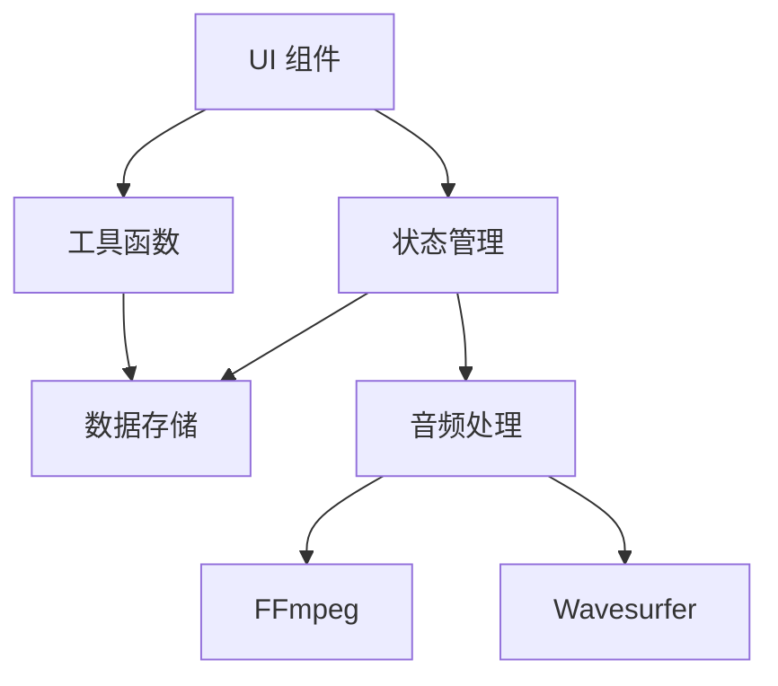

# Visual Split Mark 开发者文档

欢迎来到 Visual Split Mark 的开发者文档。本文档将帮助你了解项目的技术细节和架构设计。

## 目录

1. [项目结构](./structure.md)
   - 目录结构
   - 文件组织
   - 命名规范

2. [核心模块](./core/README.md)
   - [音频处理](./core/audio.md)
   - [数据存储](./core/storage.md)
   - [状态管理](./core/state.md)
   - [Whisper API](./core/whisper.md)

3. [组件文档](./components/README.md)
   - [项目管理](./components/project.md)
   - [音频播放器](./components/player.md)
   - [标注编辑器](./components/editor.md)
   - [导出功能](./components/export.md)

4. [工具函数](./utils/README.md)
   - [音频处理](./utils/audio.md)
   - [文件操作](./utils/file.md)
   - [数据转换](./utils/converter.md)

5. [API 文档](./api/README.md)
   - [项目 API](./api/project.md)
   - [音频 API](./api/audio.md)
   - [标注 API](./api/annotation.md)

6. [状态管理](./store/README.md)
   - [项目状态](./store/project.md)
   - [音频状态](./store/audio.md)
   - [标注状态](./store/annotation.md)

7. [测试](./testing/README.md)
   - [单元测试](./testing/unit.md)
   - [集成测试](./testing/integration.md)
   - [E2E 测试](./testing/e2e.md)

8. [部署](./deployment/README.md)
   - [环境配置](./deployment/environment.md)
   - [构建过程](./deployment/build.md)
   - [部署指南](./deployment/guide.md)

## 快速开始

1. 克隆项目并安装依赖：
```bash
git clone https://github.com/yourusername/visual-split-mark.git
cd visual-split-mark
yarn install
```

2. 启动开发服务器：
```bash
yarn dev
```

3. 运行测试：
```bash
yarn test
```

## 开发规范

1. **代码风格**
   - 使用 TypeScript
   - 遵循 ESLint 配置
   - 使用 Prettier 格式化代码

2. **提交规范**
   - 使用语义化的提交消息
   - 每个提交解决一个问题
   - 保持提交历史清晰

3. **分支管理**
   - `main`: 主分支，保持稳定
   - `develop`: 开发分支
   - `feature/*`: 特性分支
   - `fix/*`: 修复分支

4. **测试要求**
   - 新功能必须包含单元测试
   - 修复 bug 必须包含相关测试
   - 保持测试覆盖率

## 架构概览

Visual Split Mark 采用前端单页应用架构，主要包含以下部分：

1. **UI 层**
   - 使用 Naive UI 组件库
   - 自定义组件封装
   - 响应式设计（仅桌面端）

2. **业务逻辑层**
   - Pinia 状态管理
   - 音频处理逻辑
   - 数据持久化

3. **数据层**
   - LocalStorage 存储
   - 文件系统交互
   - API 调用

4. **工具层**
   - FFmpeg 音频处理
   - Wavesurfer 波形显示
   - 工具函数库

## 模块依赖



## 开发工具

- VS Code
- Vue Devtools
- Chrome DevTools
- Postman（API 测试）

## 常见问题

1. **开发环境配置**
   - Node.js 版本要求
   - 依赖安装问题
   - 环境变量设置

2. **音频处理**
   - FFmpeg.js 使用注意事项
   - 音频格式转换问题
   - 性能优化建议

3. **数据存储**
   - LocalStorage 限制
   - 文件系统交互
   - 数据备份建议

## 贡献指南

1. 查看[问题列表](https://github.com/yourusername/visual-split-mark/issues)
2. 选择要解决的问题
3. Fork 项目并创建特性分支
4. 开发并测试你的代码
5. 提交 Pull Request

## 联系我们

- 问题反馈：[Issues](https://github.com/yourusername/visual-split-mark/issues)
- 邮件联系：your.email@example.com
- 讨论组：[Discussions](https://github.com/yourusername/visual-split-mark/discussions) 