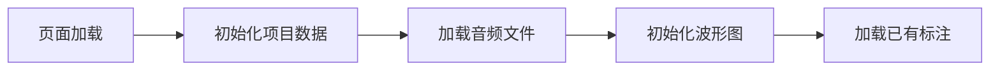
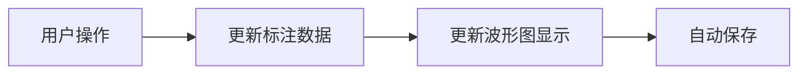

# 音频标注页面

## 组件概述

音频标注页面(`pages/annotation/[id].vue`)是一个复杂的音频处理组件，提供音频文件的波形可视化和标注功能。该组件支持音频播放控制、波形缩放、标注管理等功能，是音频标注工作的核心界面。

## 功能特性

- 音频波形可视化
- 音频播放控制（播放/暂停、倍速调节）
- 波形缩放控制
- 标注管理（添加、编辑、删除）
- 文本识别（Whisper API）
- 标注数据导出

## 技术栈

### 外部依赖
- **naive-ui**: UI组件库，提供基础界面组件
- **date-fns**: 日期处理工具库
- **@vicons/ionicons5**: 图标库

### 内部依赖
- **useAudioVisualizer**: 音频可视化核心功能
- **storage**: 数据持久化
- **whisper**: Whisper API 接口
- **project**: 项目类型定义和状态管理

## 组件结构

### 状态管理

1. 页面状态
```typescript
interface PageState {
  isPlaying: boolean;          // 播放状态
  duration: number;            // 音频总时长
  currentTime: number;         // 当前播放时间
  pixelsPerSecond: number;     // 波形图缩放比例
  selectedRegion: Region;      // 当前选中区域
  playbackRate: number;        // 播放速率
}
```

2. 标注状态
```typescript
interface AnnotationState {
  annotations: Annotation[];           // 标注列表
  pendingAnnotation: Annotation;       // 待处理标注
  editingAnnotation: Annotation;       // 正在编辑的标注
  annotationText: string;             // 标注文本
}
```

3. UI状态
```typescript
interface UIState {
  showDeleteModal: boolean;    // 删除确认对话框
  showTextInputModal: boolean; // 文本输入对话框
  transcribing: boolean;       // 文本识别状态
  exporting: boolean;          // 导出状态
}
```

### 主要功能模块

1. 音频控制
```typescript
// 播放控制
const handlePlayPause = () => void;
// 倍速控制
const handleIncreaseRate = () => void;
const handleDecreaseRate = () => void;
// 缩放控制
const handleZoomIn = () => void;
const handleZoomOut = () => void;
```

2. 标注管理
```typescript
// 标注操作
const handleAddAnnotation = () => void;
const handleEditAnnotation = (annotation: Annotation) => void;
const handleConfirmAnnotation = () => Promise<void>;
const handleDeleteClick = (annotation: Annotation) => void;
const handleConfirmDelete = () => Promise<void>;
```

3. 数据处理
```typescript
// 文本识别
const handleTranscribe = () => Promise<void>;
// 导出标注
const handleExport = () => Promise<void>;
// 自动保存
const saveToStorage = () => Promise<void>;
```

## 生命周期

1. 初始化流程
```typescript
onMounted(async () => {
  // 1. 初始化项目数据
  await projectStore.initialize();
  // 2. 加载音频文件
  // 3. 初始化波形图
  await initializeVisualizer();
  // 4. 加载已有标注
  // 5. 设置事件监听
});
```

2. 清理流程
```typescript
onUnmounted(() => {
  // 1. 销毁波形图
  destroy();
  // 2. 移除事件监听
  window.removeEventListener('keydown', handleKeydown);
});
```

## 事件处理

1. 键盘事件
- `Space`: 播放/暂停控制

2. 标注事件
- `onAddButtonClick`: 添加标注
- `onEditButtonClick`: 编辑标注
- `onDeleteButtonClick`: 删除标注

## 数据流

1. 数据加载流程


2. 标注操作流程


## 使用示例

```vue
<template>
  <annotation-page :audio-file-id="id" />
</template>

<script setup>
const route = useRoute();
const id = route.params.id;
</script>
```

## 注意事项

1. 性能考虑
   - 波形图渲染可能会占用较多资源
   - 自动保存功能需要适当节流
   - 大文件加载时需要显示加载状态

2. 错误处理
   - 音频文件加载失败的处理
   - 标注操作失败的回滚机制
   - 网络请求超时的处理

3. 待优化点
   - Whisper API 集成完善
   - 标注相关逻辑抽取为独立 composable
   - 添加更多键盘快捷键
   - 优化自动保存性能

## 贡献指南

1. 代码风格
   - 使用 TypeScript 类型定义
   - 遵循 Vue 3 组合式 API 规范
   - 保持组件职责单一

2. 测试要求
   - 核心功能单元测试
   - 用户交互集成测试
   - 性能测试基准 

## 音频加载和波形渲染

### 音频加载流程

音频加载由 `useAudioPlayer` 组件处理，主要步骤如下：

1. 初始化音频元素
```typescript
const initialize = async (audioFile: AudioFile) => {
  // 创建音频元素
  audioElement.value = new Audio()
  audioElement.value.crossOrigin = 'anonymous'
  
  // 加载音频文件
  const blob = await loadBlob(audioFile.wavPath)
  const arrayBuffer = await blob.arrayBuffer()
  
  // 创建音频上下文
  audioContext.value = new AudioContext()
  
  // 解码音频数据
  const audioBuffer = await audioContext.value.decodeAudioData(arrayBuffer)
  duration.value = audioBuffer.duration
  
  // 获取波形数据
  channelData = audioBuffer.getChannelData(0)
  
  // 创建音频源并连接
  audioElement.value.src = URL.createObjectURL(blob)
  const source = audioContext.value.createMediaElementSource(audioElement.value)
  source.connect(audioContext.value.destination)
}
```

2. 音频状态管理
```typescript
interface AudioState {
  isPlaying: boolean;        // 播放状态
  duration: number;          // 音频总时长
  currentTime: number;       // 当前播放时间
  playbackRate: number;      // 播放速率
}
```

### 波形渲染流程

波形渲染由 `useWaveformDrawer` 组件处理，包含以下主要部分：

1. 画布初始化
```typescript
const initialize = (container: HTMLElement) => {
  canvas.value = document.createElement('canvas')
  canvas.value.className = 'vertical-waveform'
  canvas.value.width = container.clientWidth
  canvasCtx.value = canvas.value.getContext('2d')
}
```

2. 波形绘制
```typescript
const drawWaveform = (
  duration: number,
  currentTime: number | null,
  pixelsPerSecond: number,
  regions: Map<string, Region>,
  hoveredRegion: { id: string } | null,
  selectionRange: { start: number; end: number } | null,
  editingAnnotation: { id: string } | null,
  buttonBounds: {
    add: { x: number; y: number; width: number; height: number } | null;
    edit: { x: number; y: number; width: number; height: number } | null;
    delete: { x: number; y: number; width: number; height: number } | null;
  }
) => {
  // 计算总高度
  const totalHeight = duration * pixelsPerSecond + PADDING * 2
  
  // 绘制波形
  const barWidth = 1
  const barGap = 1
  const totalBars = Math.floor((totalHeight - PADDING * 2) / (barWidth + barGap))
  const samplesPerBar = Math.floor(channelData.value.length / totalBars)
  
  // 遍历每个采样点绘制波形
  for (let i = 0; i < totalBars; i++) {
    const startSample = i * samplesPerBar
    const endSample = startSample + samplesPerBar
    let max = 0
    
    // 计算每个区间的最大振幅
    for (let j = startSample; j < endSample; j++) {
      const amplitude = Math.abs(channelData.value[j])
      if (amplitude > max) {
        max = amplitude
      }
    }
    
    // 绘制波形条
    const barHeight = max * WAVEFORM_WIDTH * 0.8
    const x = TIME_AXIS_WIDTH + (WAVEFORM_WIDTH - barHeight) / 2
    const y = i * (barWidth + barGap) + PADDING
    canvasCtx.value.fillRect(x, y, barHeight, barWidth)
  }
}
```

3. 时间轴绘制
```typescript
const drawTimeAxis = (duration: number, pixelsPerSecond: number) => {
  // 根据缩放级别选择合适的时间间隔
  let timeInterval = 30
  let minorInterval = 5
  
  if (pixelsPerSecond >= 30) {
    timeInterval = 1
    minorInterval = 0.2
  } else if (pixelsPerSecond >= 15) {
    timeInterval = 2
    minorInterval = 0.5
  }
  // ... 其他缩放级别
  
  // 绘制次要刻度
  for (let second = 0; second <= totalSeconds; second += minorInterval) {
    const y = getYFromTime(second, canvas.value, duration)
    // 绘制刻度线
  }
  
  // 绘制主要刻度和文本
  for (let second = 0; second <= totalSeconds; second += timeInterval) {
    const y = getYFromTime(second, canvas.value, duration)
    // 绘制刻度线和时间文本
  }
}
```

4. 区域绘制
```typescript
const drawRegions = (
  regions: Map<string, Region>,
  hoveredRegion: { id: string } | null,
  editingAnnotation: { id: string } | null,
  duration: number,
  buttonBounds: {
    edit: { x: number; y: number; width: number; height: number } | null;
    delete: { x: number; y: number; width: number; height: number } | null;
  }
) => {
  regions.forEach((region, id) => {
    // 计算区域位置
    const startY = getYFromTime(region.start, canvas.value!, duration)
    const endY = getYFromTime(region.end, canvas.value!, duration)
    
    // 绘制区域背景
    // 绘制区域边框
    // 绘制手柄（如果处于编辑或悬停状态）
    // 绘制区域文本
  })
}
```

### 交互控制

1. 缩放控制
```typescript
const zoomIn = () => {
  pixelsPerSecond.value = Math.min(pixelsPerSecond.value * 1.5, 1000)
  updateDrawing()
}

const zoomOut = () => {
  pixelsPerSecond.value = Math.max(pixelsPerSecond.value / 1.5, 10)
  updateDrawing()
}
```

2. 播放控制
```typescript
const playPause = () => {
  if (audioElement.value) {
    if (isPlaying.value) {
      audioElement.value.pause()
    } else {
      audioElement.value.play()
    }
  }
}

const seek = (time: number) => {
  if (audioElement.value) {
    audioElement.value.currentTime = time
  }
}
```

### 性能优化

1. 波形渲染优化
   - 使用固定的条形宽度和间隔
   - 根据可视区域计算采样点
   - 使用 requestAnimationFrame 进行动画更新

2. 缩放优化
   - 缩放时使用节流控制更新频率
   - 限制最大和最小缩放比例
   - 根据缩放级别动态调整时间轴刻度间隔 